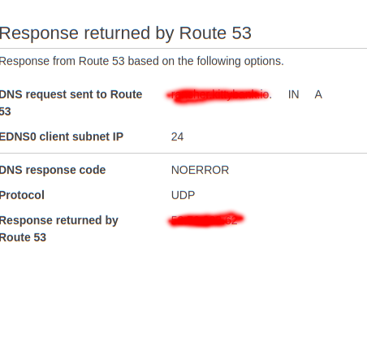
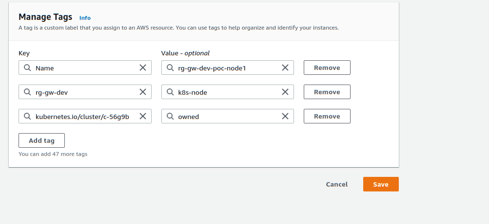

## Requirements
### Client Machine tools
  - **kubectl** https://kubernetes.io/docs/tasks/tools/install-kubectl/
  - **aws cli**  https://docs.aws.amazon.com/cli/latest/userguide/install-cliv2.html
  - **docker**  https://docs.docker.com/engine/
  - **helm** https://helm.sh/docs/intro/install/

### AWS requirements
   - An IAM user with **SystemAdministrator** policy attached. If yuo don't have permission to change Policies or create ECR repository contact the administrator.


## Setting up AWS Resource Group

1. Open the Resource Group console at https://console.aws.amazon.com/resource-groups
2. In **Create Resource Group**, select Tag Based.
3. Add two tags with: 
    
    1. Key rg-gw-dev leave optional tag value blank
4. These will be used later when creating EC2 instances for rancher and k8s
    
5. Add group name then choose **Create Group**


## Setting up AWS EC2 instance for Rancher for Flavour A

1. Open the EC2 console at https://console.aws.amazon.com/ec2/
2. Click on instances
 
3. Launch instances
 
4. In **Step 1: Choose an Amazon Machine Image (AMI)**, Select **Ubuntu Server 20.04 LTS (HVM), SSD Volume Type**.
 
5. In **Step 2: Choose an Instance Type**, For Flavour A, We went with t3a.medium because of the minimum requirement for Rancher  choose **Next: Configure Instance Details**.
 
6. In **Step 3: Choose an Instance Type**, Leave everything to default and choose **Next: Add Storage**.
 
 
7. In **Step 4: Add Storage**, change size to 30GB then choose **Next: Add Tags**
 
8. In **Step 5: Add Tags**, add a tags. 
      1. with **key rg-gw-dev and name rancher** i.e the tag we added in our Resource Group. The tag should match the one you created in Resource Group since we are using Resource Group based on tags
      2. with **key Name and name rancher**
   Choose **Next: Configure Security Group**
 
9. In **Step 6: Configure Security Group**, select Create a new security group if not previously created. Give the name and description for the security group. Leave everything to default and choose **Next: Review Instance Launch**
 
10. In **Step 7: Review Instance Launch**, review everything and **Click on Launch**
11. Download the key pair to ssh into the server later. If you don’t download the keypair now you won’t be able to in the future
 
12. Launch instances
  

## Associate Elastic IP to Rancher Instance
The public ip AWS assings isn't persistent and will change everytime you shutdown the instace.So, you'll need to set-up an Elastic IP.
1. Open the EC2 console at http://console.aws.amazon.com/ec2
2. Select **Elastic IP** and click on **Allocate Elastic IP address**
   
3. Choose **Allocate**
   
4. Select the newly created Elastic IP, choose actions then choose **Associate IP address**
   
5. Select the Rancher instance and select the private ip that has been associated with the rancher instance.Choose **Associate**
   


## Setting up Route 53 for Rancher Instance 
**The following steps are done using the old console. Switch to the old console before proceeding.**
1. Open the Route 53 Console https://console.aws.amazon.com/route53
2. Select **Hosted Zone**
   
3. Click on **Create Hosted Zone** and enter your domain name you want to use for the AWS instances
4. Copy the NS value and follow the process of your registrar for the domain to change the name servers of your domain to user the four Route 54 name server that you got after step 3.
   
5.  Then we need to create an A record for the Rancher instance. Click on **Create Record Set**
   
6.  Add a subdomain or leave it blank. Select **Type: A - IPv4 address** if not previously selected and type in the Elastic IP retrieved from https://k8-proxy.github.io/k8-proxy-documentation/docs/flavors/flavor-a/manual-setup-aws#associate-elastic-ip-to-rancher-instance  in **value**.
   
7. Click on **Create**
8. Select the newly created a record and Click on **Test Record Set** to check if the record is working or not.
   
9. Click on **Get Response**. You'll see **DNS response code:  NOERROR** if it's working. 
   


## IAM user for Rancher
1. Open the IAM user console http://console.aws.amazon.com/iam
2. Click on Users
   
3. Click on **Add User**
4. Give name to the group and select **Programmatic access**, choose **Next: Permissions**
   
5. Click on Create Group 
   
6. Type in the name of the group and search for **AmazonEC2FullAccess** and select it then click on **Create group**
   
7. Select the newly created group, choose **Next: Tags**
8. Add tags for the user i.e key rg-gw-dev name rancher-user, choose **Next: Review**
   
9. Review then choose **Create User**
10. Download the CSV or save the Access key ID and Secret access key which will be used later for rancher
   
11. Close

## Setting up Rancher
### Before following the Rancher Docs
It is highly advised to have a domain for the Rancher instance or you'll be facing tons of issues.
Use the **Access key id** and **Secret access Key** that was retrieved in https://k8-proxy.github.io/k8-proxy-documentation/docs/flavors/flavor-a/manual-setup-aws#iam-user-for-rancher when Rancher asks for it.
After you have everything required follow the steps below:
1. SSH to Rancher instance using the keypair that you retrieved from https://k8-proxy.github.io/k8-proxy-documentation/docs/flavors/flavor-a/manual-setup-aws#setting-up-aws-ec2-instance-for-rancher-for-flavour-a
  
2. Install docker
   ```
   sudo apt-get update
   sudo apt-get install apt-transport-https  ca-certificates  curl  gnupg-agent software-properties-common
   curl -fsSL https://download.docker.com/linux/ubuntu/gpg | sudo apt-key add -
   sudo apt-key fingerprint 0EBFCD88
   sudo apt-get update
   sudo apt-get install docker-ce docker-ce-cli containerd.io
   ```
3. Deploy rancher server using docker
   ```
    docker run -d --restart=unless-stopped \
    -p 8080:80 -p 8443:443 \
    --privileged \
    rancher/rancher:latest \
    --no-cacerts
    ```
4. Install Apache2 and enable proxy and rewrite
   ```
    sudo apt-get install apache2
    sudo a2enmod proxy proxy_http proxy_wstunnel proxy_balancer proxy_connect headers
    sudo a2enmod rewrite 
    sudo systemctl restart apache2
   ```
5. Edit the vhost conf file. Replace the  your-rancher-domain with domain configure in https://k8-proxy.github.io/k8-proxy-documentation/docs/flavors/flavor-a/manual-setup-aws#setting-up-route-53-for-rancher-instance 
   ```
   sudo vi /etc/apache2/sites-available/000-default.conf
   ```
   Change it to 
   ```
   <VirtualHost *:80>
    ServerName <your-rancher-domain>
    ProxyRequests Off
    ProxyPreserveHost On
    RewriteEngine On
    RewriteCond %{HTTP:Connection} Upgrade [NC]
    RewriteCond %{HTTP:Upgrade} websocket [NC]
    RewriteRule /(.*) ws://0.0.0.0:8080/$1 [P,L]
    RequestHeader set X-Forwarded-Proto "https"
    RequestHeader set X-Forwarded-Port "443"
    <Location />
      ProxyPass "http://0.0.0.0:8080/"
      ProxyPassReverse "http://0.0.0.0:8080/"
    </Location>
    ErrorLog ${APACHE_LOG_DIR}/rancher-website-error.log
    CustomLog ${APACHE_LOG_DIR}/rancher-website-access.log combined
   </VirtualHost>
   ```
6. Save and restart apache2
   ```
     sudo systemctl restart apache2
   ```
7. Install certbot https://certbot.eff.org/lets-encrypt/ubuntufocal-apache and run 
   ```
   sudo snap install core; sudo snap refresh core

   sudo snap install --classic certbot

   sudo ln -s /snap/bin/certbot /usr/bin/certbot

   sudo certbot --apache
   ```
8. Select the domain that you added in your vhost

   **If you don't want the IP to change everytime the instance gets rebooted or shutdown then Elastic IP is recommended.**
   ### For instance with dynamic public IP
      1. Open your rancher domain and follow from step 2. from the link https://github.com/k8-proxy/s-k8-proxy-rebuild/blob/master/stable-src/README.md#installation-steps-to-deploy-k8s-cluster-on-ec2-instances-using-rancher
      2. A new instance will be created in EC2 instance console.
   ### For instance with Elastic IP(Recommended)
      1. Follow these steps but instead of rancher, it's for Flavour A. So change the tags from **rg-gw-dev: rancher** and **Name: rancher** to
         **Name: Flavour-a** and **rg-gw-dev: Flavour-a** 
         #### Important
         When in the **Security Group** section don't forget to open up the required ports for Rancher. https://rancher.com/docs/rancher/v2.x/en/installation/requirements/ports/
         
         


         1. https://k8-proxy.github.io/k8-proxy-documentation/docs/flavors/flavor-a/manual-setup-aws#setting-up-aws-ec2-instance-for-rancher-for-flavour-a
         2. https://k8-proxy.github.io/k8-proxy-documentation/docs/flavors/flavor-a/manual-setup-aws#associate-elastic-ip-to-rancher-instance
      2. Open your rancher domain.
      3. Select **Add Cluster**
      4. Select **Existing Node**
      5. Name the Cluster rg-gw-dev-flavour-a
      6. In **In-Tree Cloud Provide**, choose **Custom**
         

      7. Click on **Next**
      8. Select **etcd**, **Control Plane**, **Worker**
         
         
      9. Click on **Show advanced options**
      10. Enter the **Node Public Address**(Elastic IP), **Node Internal Address**(Private IPv4 addresses), **Node Name**(The value you added in as Name as tag when creating the EC2 instance eg. if you have a key Name and the value is set to flavour-a, use flavour-a), which can be found in instance details tab when you select the newly created instance in the EC2 console.
         
      11. Copy the docker command.
      11. SSH to the instance using the keypair that you retrieved in step 1.
      12. Install docker
         ```
         sudo apt-get update
         sudo apt-get install apt-transport-https  ca-certificates  curl  gnupg-agent software-properties-common
         curl -fsSL https://download.docker.com/linux/ubuntu/gpg | sudo apt-key add -
         sudo apt-key fingerprint 0EBFCD88
         sudo apt-get update
         sudo apt-get install docker-ce docker-ce-cli containerd.io
         ```
      13. Paste the command and run.
      14. Go to your rancher console and select done.

## Creating an IAM user for Docker Repository 
1. Open the IAM user console http://console.aws.amazon.com/iam
2. Click on Policies
3. Click on **Create policy**
4. Select JSON and paste the following
   ```
      {
    "Version": "2012-10-17",
    "Statement": [
        {
            "Sid": "VisualEditor0",
            "Effect": "Allow",
            "Action": [
                "ecr:PutImageTagMutability",
                "ecr:StartImageScan",
                "ecr:ListTagsForResource",
                "ecr:UploadLayerPart",
                "ecr:BatchDeleteImage",
                "ecr:ListImages",
                "ecr:CompleteLayerUpload",
                "ecr:TagResource",
                "ecr:DescribeRepositories",
                "ecr:BatchCheckLayerAvailability",
                "ecr:GetLifecyclePolicy",
                "ecr:PutLifecyclePolicy",
                "ecr:DescribeImageScanFindings",
                "ecr:GetLifecyclePolicyPreview",
                "ecr:PutImageScanningConfiguration",
                "ecr:GetDownloadUrlForLayer",
                "ecr:GetAuthorizationToken",
                "ecr:DeleteLifecyclePolicy",
                "ecr:PutImage",
                "ecr:UntagResource",
                "ecr:BatchGetImage",
                "ecr:DescribeImages",
                "ecr:StartLifecyclePolicyPreview",
                "ecr:InitiateLayerUpload",
                "ecr:GetRepositoryPolicy"
            ],
            "Resource": "*"
        }
      ]
     }
   ```
   

5. Click on **Review Policy**
6. Name the policy and click on **Create policy**
   
7. Click on Users
8. Click on Add User
9. Give name to the group and select **Programmatic access**, choose **Next: Permissions**
10. Click on Create Group 
11. Type in the name of the group and search for the policy you just created and select it then click on **Create group**
12. Select the newly created group, choose **Next: Tags**
13. Add tags for the user i.e key rg-gw-dev name ecr-user, choose **Next: Review**
14. Review then choose **Create User**
15. Download the CSV or save the Access key ID and Secret access key which will be used later for rancher
16. Close

## Adding Tags to Security Group and k8s EC2 Instance for AWS Resource Group
### Adding tags to Security Group
1. Open the EC2 console https://console.aws.amazon.com/ec2/
2. Select **Security Groups**
3. Select a security group
4. Click on **Tags** at the bottom right.
   
5. Click on **Manage tags**.
6. Click on **Add tags** and add a tag
   
7. Click on **Save Changes**
Do the above step for all security group
### Adding tags to Security Group
1. Open the EC2 console https://console.aws.amazon.com/ec2/
2. Select **Instances**
3. Select a EC2 instance
4. Click on **Tags** at the bottom right.

   
5. Click on **Manage tags**.
6. Click on **Add tags** and add a tag

   
7. Click on **Save Changes**
Do the above step for all security group


## Setting up Repository for Docker in AWS
This setup assumes that the nginx, squid and icap applications are in the same repository,seperated by tags instead
1. Open the ECR console https://console.aws.amazon.com/ecr/home
2. Click on **Create repository**
3. Type in a repository name then click on **Create Repository**, You'll find a URI for your docker repo on the console copy it
4. In your client machine, follow these steps to install the aws cli https://docs.aws.amazon.com/cli/latest/userguide/install-cliv2.html
5. Run the command and type in the AWS Access Key ID, AWS Secret Access Key, Default region name, and type in **json** in Default output format
   ```
    aws configure
   ```
   
  
6. Install docker if you already have not.
   ```
    sudo apt-get update
    sudo apt-get install apt-transport-https  ca-certificates  curl  gnupg-agent software-properties-common
    curl -fsSL https://download.docker.com/linux/ubuntu/gpg | sudo apt-key add -
    sudo apt-key fingerprint 0EBFCD88
    sudo apt-get update
    sudo apt-get install docker-ce docker-ce-cli containerd.io
   ```

   Login to the ECR docker. Replace with URI with the docker-registry-url
    ```
     aws ecr get-login-password --region ap-southeast-1 | docker login --username AWS --password-stdin <docker-registry-url>
    ```
7. Install kubectl if you haven't https://kubernetes.io/docs/tasks/tools/install-kubectl/. Create a registry secret to give permission to the kubectl to push in ECR. Replace the AccountID with your AWS Account ID
   ```
      #
      # RUN me where kubectl is available,& make sure to replace account,region etc
      #
      ACCOUNT=<ACCOUNT-ID>
      REGION=ap-southeast-1
      SECRET_NAME=${REGION}-ecr-registry

      #
      # Fetch token (which will expire in 12 hours)
      #

      TOKEN=`aws ecr --region=$REGION get-authorization-token --output text --query authorizationData[].authorizationToken | base64 -d | cut -d: -f2`

      #
      # Create or replace registry secret
      #
      echo TOKEN
      kubectl delete secret --ignore-not-found $SECRET_NAME
      kubectl create secret docker-registry $SECRET_NAME \
      --docker-server=https://${ACCOUNT}.dkr.ecr.${REGION}.amazonaws.com \
      --docker-username=AWS \
      --docker-password="${TOKEN}" \
   ```
8. Clone the https://github.com/k8-proxy/k8-reverse-proxy repository and checkout develop branch
   ```
   git clone https://github.com/k8-proxy/k8-reverse-proxy.git --recursive
   cd stable-src
   git checkout develop
   ```
9. Build the applications and push
   ```
    docker build nginx -t <docker-registry-url>:reverse-proxy-nginx-0.0.1
    docker build squid -t <docker-registry-url>:reverse-proxy-squid-0.0.1
    wget -O c-icap/Glasswall-Rebuild-SDK-Evaluation/Linux/Library/libglasswall.classic.so https://github.com/filetrust/Glasswall-Rebuild-SDK-Evaluation/releases/download/1.117/libglasswall.classic.so
    docker build icap -t <docker-registry-url>:reverse-proxy-icap-0.0.1
    docker push <docker-registry-url>/reverse-proxy-nginx-0.0.1
    docker push <docker-registry-url>/reverse-proxy-squid-0.0.1
    docker push <docker-registry-url>/reverse-proxy-icap-0.0.1
   ```
10. Install helm if you haven't already https://helm.sh/docs/intro/install/
11. Clone the https://github.com/k8-proxy/s-k8-proxy-rebuild repository
    ```
    git clone https://github.com/k8-proxy/s-k8-proxy-rebuild.git
    cd stable-src
    ```
12. Edit the values.yaml in chart folder and add paste the following then replace the docker-registry-url
    ```
         # Default values for chart.
      # This is a YAML-formatted file.
      # Declare variables to be passed into your templates.
      replicaCount: 1
      image:
      nginx:
         repository: <docker-registry-url>
         tag: nginx-0.0.2
         pullPolicy: IfNotPresent
      squid:
         repository: <docker-registry-url>
         tag: squid-reverse-0.0.2
         pullPolicy: IfNotPresent
      icap:
         repository: <docker-registry-url>
         tag: gw-icap-0.0.2
         pullPolicy: IfNotPresent
      podAnnotations: {}
      application:
      nginx:
         secretName: reverse-proxy-nginx
         env:
            ALLOWED_DOMAINS: gov.uk.glasswall-icap.com,www.gov.uk.glasswall-icap.com,assets.publishing.service.gov.uk.glasswall-icap.com,www.nekoffice.com.glasswall-icap.com,nekoffice.com.glasswall-icap.com,xamariners.sharepoint.com.glasswall-icap.com,glasswallk8.sharepoint.com.glasswall-icap.com,login.microsoftonline.com.glasswall-icap.com,aadcdn.msauth.net.glasswall-icap.com,login.windows.net.glasswall-icap.com,aadcdn.msftauth.net.glasswall-icap.com,mysigns.microsoft.com.glasswall-icap.com,account.activedirectory.windowsazure.com.glasswall-icap.com,shell.cdn.office.net.glasswall-icap.com,spoprod-a.akamaihd.net.glasswall-icap.com,browser.pipe.aria.microsoft.com.glasswall-icap.com,amcdn.msftauth.net.glasswall-icap.com,r4.res.office365.com.glasswall-icap.com,substrate.office.com.glasswall-icap.com,lpcres.delve.office.com.glasswall-icap.com,webshell.suite.office.com.glasswall-icap.com,loki.delve.office.com.glasswall-icap.com,mysignins.microsoft.com.glasswall-icap.com,static2.sharepointonline.com.glasswall-icap.com
            ROOT_DOMAIN: glasswall-icap.com
            SUBFILTER_ENV: ".gov.uk,.gov.uk.glasswall-icap.com  .amazonaws.com,.amazonaws.com.glasswall-icap.com .nekoffice.com,.nekoffice.com.glasswall-icap.com .xamariners.sharepoint.com,.xamariners.sharepoint.com.glasswall-icap.com .glasswallk8.sharepoint.com,.glasswallk8.sharepoint.com.glasswall-icap.com .login.microsoftonline.com,.login.microsoftonline.com.glasswall-icap.com .aadcdn.msauth.net,.aadcdn.msauth.net.glasswall-icap.com .login.windows.net,.login.windows.net.glasswall-icap.com .aadcdn.msftauth.net,.aadcdn.msftauth.net.glasswall-icap.com .mysigns.microsoft.com,.mysigns.microsoft.com.glasswall-icap.com .account.activedirectory.windowsazure.com,.account.activedirectory.windowsazure.com.glasswall-icap.com .shell.cdn.office.net,.shell.cdn.office.net.glasswall-icap.com .spoprod-a.akamaihd.net,.spoprod-a.akamaihd.net.glasswall-icap.com .browser.pipe.aria.microsoft.com,.browser.pipe.aria.microsoft.com.glasswall-icap.com .amcdn.msftauth.net,.amcdn.msftauth.net.glasswall-icap.com .r4.res.office365.com,.r4.res.office365.com.glasswall-icap.com .substrate.office.com,.substrate.office.com.glasswall-icap.com .lpcres.delve.office.com,.lpcres.delve.office.com.glasswall-icap.com .webshell.suite.office.com,.webshell.suite.office.com.glasswall-icap.com .loki.delve.office.com,.loki.delve.office.com.glasswall-icap.com .mysignins.microsoft.com,.mysignins.microsoft.com.glasswall-icap.com .static2.sharepointonline.com,.static2.sharepointonline.com.glasswall-icap.com"
         secrets: {}
      squid:
         secretName: reverse-proxy-squid
         env:
            ALLOWED_DOMAINS: gov.uk.glasswall-icap.com,www.gov.uk.glasswall-icap.com,assets.publishing.service.gov.uk.glasswall-icap.com,www.nekoffice.com.glasswall-icap.com,nekoffice.com.glasswall-icap.com,xamariners.sharepoint.com.glasswall-icap.com,glasswallk8.sharepoint.com.glasswall-icap.com,login.microsoftonline.com.glasswall-icap.com,aadcdn.msauth.net.glasswall-icap.com,login.windows.net.glasswall-icap.com,aadcdn.msftauth.net.glasswall-icap.com,mysigns.microsoft.com.glasswall-icap.com,account.activedirectory.windowsazure.com.glasswall-icap.com,shell.cdn.office.net.glasswall-icap.com,spoprod-a.akamaihd.net.glasswall-icap.com,browser.pipe.aria.microsoft.com.glasswall-icap.com,amcdn.msftauth.net.glasswall-icap.com,r4.res.office365.com.glasswall-icap.com,substrate.office.com.glasswall-icap.com,lpcres.delve.office.com.glasswall-icap.com,webshell.suite.office.com.glasswall-icap.com,loki.delve.office.com.glasswall-icap.com,mysignins.microsoft.com.glasswall-icap.com,static2.sharepointonline.com.glasswall-icap.com
            ROOT_DOMAIN: glasswall-icap.com
         secrets: {}
      icap:
         secretName: reverse-proxy-icap
         env: {}
         secrets: {}

      service:
      nginx:
         enabled: true
         annotations: {}
         name: nginx
         type: ClusterIP
         additionalHosts:
         - glasswallk8.sharepoint.com.glasswall-icap.com
         - login.microsoftonline.com.glasswall-icap.com
         - aadcdn.msauth.net.glasswall-icap.com
         - login.windows.net.glasswall-icap.com
         - aadcdn.msftauth.net.glasswall-icap.com
         - mysigns.microsoft.com.glasswall-icap.com
         - account.activedirectory.windowsazure.com.glasswall-icap.com
         - shell.cdn.office.net.glasswall-icap.com
         - spoprod-a.akamaihd.net.glasswall-icap.com
         - browser.pipe.aria.microsoft.com.glasswall-icap.com
         - amcdn.msftauth.net.glasswall-icap.com
         - r4.res.office365.com.glasswall-icap.com
         - substrate.office.com.glasswall-icap.com
         - lpcres.delve.office.com.glasswall-icap.com
         - webshell.suite.office.com.glasswall-icap.com
         - loki.delve.office.com.glasswall-icap.com
         - mysignins.microsoft.com.glasswall-icap.com
         - static2.sharepointonline.co.glasswall-icap.com
         - xamariners.sharepoint.com.glasswall-icap.com
         - www.nekoffice.com.glasswall-icap.com
         - www.gov.uk.glasswall-icap.com
         - assets.publishing.service.gov.uk.glasswall-icap.com
         commonName:
         externalPort: 443
         internalPort: 443
         url: gov.uk.glasswall-icap.com
      squid:
         enabled: true
         annotations: {}
         name: squid
         type: ClusterIP
         additionalHosts:
         externalPort: 8080
         internalPort: 8080
      icap:
         enabled: true
         annotations: {}
         name: icap
         type: ClusterIP
         additionalHosts:
         externalPort: 1344
         internalPort: 1344
      ingress:
      enabled: true
      tls:
         enabled: true
         secretName: secret-tls-nekoffice
      annotations:
         nginx.ingress.kubernetes.io/ssl-passthrough: "true"
         nginx.ingress.kubernetes.io/backend-protocol: "HTTPS"
         kubernetes.io/ingress.class: "nginx"
      path: /
      livenessProbe:
      path: "/"
      initialDelaySeconds: 30
      timeoutSeconds: 3
      scheme: "HTTP"
      readinessProbe:
      path: "/"
      initialDelaySeconds: 30
      timeoutSeconds: 3
      scheme: "HTTP"

      resources:
      nginx:
         limits:
            cpu: 250m
            memory: 250Mi
         requests:
            cpu: 250m
            memory: 250Mi
      squid:
         limits:
            cpu: 250m
            memory: 500Mi
         requests:
            cpu: 250m
            memory: 500Mi
      icap:
         limits:
            cpu: 500m
            memory: 500Mi
         requests:
            cpu: 500m
            memory: 500Mi

      #
      podDisruptionBudget:
      enabled: false
      # minAvailable: 1
      maxUnavailable: 1
      scale:
      nginx:
         enabled: false
         MinReplicaCount: 1
         MaxReplicaCount: 2
      squid:
         enabled: false
         MinReplicaCount: 1
         MaxReplicaCount: 2
      icap:
         enabled: false
         MinReplicaCount: 1
         MaxReplicaCount: 2
    ```
    ```
     vi chart/values.yaml
    ``` 
13. Edit the /etc/hosts and replace the k8s-cluster-ip. You'll find the ip for your k8s node on the EC2 instance console.
    ```
     <k8s-cluster-ip> gov.uk.glasswall-icap.com www.gov.uk.glasswall-icap.com assets.publishing.service.gov.uk.glasswall-icap.com www.nekoffice.com.glasswall-icap.com  nekoffice.com.glasswall-icap.com  xamariners.sharepoint.com.glasswall-icap.com  glasswallk8.sharepoint.com.glasswall-icap.com  login.microsoftonline.com.glasswall-icap.com  aadcdn.msauth.net.glasswall-icap.com  login.windows.net.glasswall-icap.com  aadcdn.msftauth.net.glasswall-icap.com  mysigns.microsoft.com.glasswall-icap.com  account.activedirectory.windowsazure.com.glasswall-icap.com  shell.cdn.office.net.glasswall-icap.com  spoprod-a.akamaihd.net.glasswall-icap.com  browser.pipe.aria.microsoft.com.glasswall-icap.com  amcdn.msftauth.net.glasswall-icap.com  r4.res.office365.com.glasswall-icap.com  substrate.office.com.glasswall-icap.com  lpcres.delve.office.com.glasswall-icap.com  webshell.suite.office.com.glasswall-icap.com  loki.delve.office.com.glasswall-icap.com  mysignins.microsoft.com.glasswall-icap.com  static2.sharepointonline.com.glasswall-icap.com
    ```
14. Run the helm command
    ```
    helm upgrade --install \
      --set image.nginx.repository=<docker-registry-url> \
      --set image.nginx.tag=reverse-proxy-nginx-0.0.1 \
      --set image.squid.repository=<docker-registry-url> \
      --set image.squid.tag=reverse-proxy-squid-0.0.1 \
      --set image.icap.repository=<docker-registry-url> \
      --set image.icap.tag=reverse-proxy-icap-0.0.1 \
      reverse-proxy chart/
    ```
13. Verify that all pods(nginx, squid, icap) are running by executing below command
    ```
     kubectl get pods
    ```
14. Follow the doc after the **kubectl get pods** part https://github.com/k8-proxy/s-k8-proxy-rebuild/tree/master/stable-src#deploy-to-kubernetes. You'll find the ip for your k8s node on the EC2 instance console.


