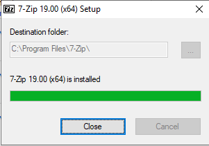

## Download Source OVA file

The very first thing we need to process is to download the OVA file that has been shared on the Github in this [link](https://github.com/k8-proxy/s-k8-releases).

Although I have used below direct link to download OVA file to create a new VM in Azure.

[https://hcompl-my.sharepoint.com/:u:/g/personal/mariusz\_ferdyn\_h\_com\_pl/EaOCuPCAb9VGjL-Fk2KWK6sBvg1j5V0g-eiwOyNVXfisRA?e=oxl4zu](https://hcompl-my.sharepoint.com/:u:/g/personal/mariusz_ferdyn_h_com_pl/EaOCuPCAb9VGjL-Fk2KWK6sBvg1j5V0g-eiwOyNVXfisRA?e=oxl4zu)

## Extract Source OVA file

After the download of \*.ova file, it needs to get converted in to VHD. But before converting the VHD, we need to extract the files of \*.ova. As OVA only supports Virtual BOX. To extract the OVA file, you need to download 7-Zip tool from this [link](https://www.7-zip.org/download.html). To follow the installation process of 7-zip, you can visit [_Annex-1 (Installation of 7-zip)_](#_Annex-1_(Installation_of)

  1. To Extract \*.ova file, select the and right click on \*.ova file. And extract the file.

  1. If the be any warning like this, ignore it. And click on '_Close_'.

  1. Validate the extraction of \*.ova file. You should be able to see two files, one \*.ovf and another \*.vmdk

## Convert OVA File to VHD

Extracted OVA file will give an extension \*.vmdk and \*.ovf file extension. Between these two files, we need to convert \*.vmdk file into VHD, the easiest way I found was to install Oracle VM Virtual BOX (To follow the steps for installation of Virtual Box visit to [_Annex-2 (Installation of Oracle VM Virtual BOX)_](#_Annex-2_(Installation_of)) and user Virtual BOX cmdlet to convert \*.vmdk file into VHD. Download Virtual Box from this [link](https://www.virtualbox.org/wiki/Downloads). Below are the steps.

  1. Open CMD on the machine and run below cmdlet.

_VBoxManage.exe clonehd --format vhd "/<vmdk file location/>" "/<desination--vhd file store location/>"_

_Eg.__VBoxManage.exe clonehd --format vhd "C:\Users\Administrator\Downloads\glasswall-proxy-cb131a57ba2aff33ec5938a283bf3747dbe91ee1\glasswall-proxy-disk001.vmdk" "C:\Users\Administrator\Downloads\glasswall-proxy-cb131a57ba2aff33ec5938a283bf3747dbe91ee1\Glassproxy1.vhd_

## Convert Dynamically Expanded VHD to Fixed Size VHD

Since, Azure does not support dynamic VHD we need to convert it into Fixed type. We need to have Hyper-V installed machine to convert dynamic type into fixed. Below are the steps to be followed.

  1. Open Hyper-V Console in the machine and Select '_Edit Disk_'.

  1. Click '_Next_' on 'Before You Begin' screen.
  2. 

  1. Select the \*.vhd file which has been converted in '[section 3.1](#_Convert_OVA_File)' and click on '_Next_'.

  1. Select '_Convert_' on 'Choose Action' screen and click on '_Next_'.

  1. Select '_VHD_' and click on '_Next_'.

  1. On '_Convert Virtual Hard Disk_' select '_Fixed size_' and click on '_Next_'.

  1. Select the location where you want to save the converted file and click on '_Next_'.

  1. Once this is completed, click on '_Finish_'.

  1. It will take while to get convert dynamically expanding disk to Fixed disk.

  1. Verify the created file by going into the specific location.

1.
## Upload VHD to Azure storage

Before Uploading VHD in Azure, we need to create Azure Storage account.

## Creating Azure Storage Account.

To create an Azure Storage account, Follow the steps as of below:

    1. Select the Resource Group on which you want to create storage account.

    1. Click on '_Add_' to add storage account.

    1. Search for Storage Account and click on '_Create_'.

    1. Provide the specification as required, select '_Storage V2_' on '_Account Kind_' and click on '_Review+Create_'

    1. Validate the configuration and click on '_Create_'.

    1. It will take while for deployment, once this is done. Click on '_Go to resource_'.

## Creating Container

    1. Once the Storage is Created, Navigate to Storage and select '_Container_'. To create a Container.

    1. Click on '_Container_', to add new Container.

    1. Specify the name of Container and click on '_Create_'.

    1. Validate the creation of Container.

## Uploading of VHD Image

Once the Container is ready, follow below steps to upload VHD Image.

    1. Connect Azure Account using PowerShell using below cmdlet
_Connect-AzAccount_ (if you do have different subscription you need to use _Select-Azsubscription_ to select different subscription/Tenant)

    1. User below cmdlet to upload image into Azure Storage.

Add-AzVhd -Destination "/<blob storage location/vhdname.vhd"/> -LocalFilePath "/<local VHD location/>" -ResourceGroupName "/<name of resourcegroup/>" -NumberofUploaderThreads 32

    1. It will take while to upload the image, once image is upload verify the cmdlet has successful ran.

# Create New VM and Assign Public IP

## Creating New VM

    1. After the VHD has been uploaded into the Azure Storage Container. Run below script to Create a new VM.

#Code for Creating VM

###############################################################################

Connect-AzAccount

Select-AzSubscription-TenantIde1a3a490-d0ff-4511-be8a-59354fb71fde

$resourceGroupName="rg-gw-dev"

$destinationVhd="https://glasswall.blob.core.windows.net/glasswall-vhd-store/Glass.vhd"

$virtualNetworkName="glasswall-vnet"

$locationName="southeastasia"

$virtualNetwork=Get-AzVirtualNetwork-ResourceGroupName$resourceGroupName-Name$virtualNetworkName

$subnet="/subscriptions/053ebc14-6f8d-4770-8bb3-744d6872c5da/resourceGroups/rg-gw-dev/providers/Microsoft.Network/virtualNetworks/glasswall-vnet/subnets/default"

$networkInterface=New-AzNetworkInterface-Name"NetworkInterface1"-ResourceGroupName$resourceGroupName-Location$locationName-SubnetId$subnet-IpConfigurationName"IPConfiguration1"-DnsServer"8.8.8.8","8.8.4.4"

#Get-AzVMSize $locationName

$vmConfig=New-AzVMConfig-VMName"Glasswall\_VM"-VMSize"Standard\_B1ms"

$vmConfig=Set-AzVMOSDisk-VM$vmConfig-Name"OSdisk"-VhdUri$destinationVhd-CreateOptionAttach-Linux

$vmConfig=Add-AzVMNetworkInterface-VM$vmConfig-Id$networkInterface.Id

$vm=New-AzVM-VM$vmConfig-Location$locationName-ResourceGroupName$resourceGroupName

################################################################################

## Assigning Public IP

    1. To assign Public IP, Select the newly created Network Interference. Click on IPConfiguration and provide the Name and Assignment of Public IP.

    1. Once Public IP is assigned, Create a NSG rule for the security Purpose on Port 22 – SSH
 Port 80 – Htt
 Port 443 – Https

## Annex-1 (Installation of 7-zip)

Here is the procedure for the installation of 7-zip. To get install, first of all download 7-zip using this [link](https://www.7-zip.org/download.html).

1. After download, Run 7-zip extraction file.

1. Click on '_Install_'.

<

1.  Once the installation is complete, click on '_close_' and verify the installation.

## Annex-2 (Installation of Oracle VM Virtual BOX)

To install the Oracle VM Virtual Box, first of all you need to download it from this [link](https://www.virtualbox.org/wiki/Downloads). Once you have downloaded the executable file, follow the below procedure.

1. Open Oracle VM Virtual Box executable file by double clicking on it and click '_Next_' on prompt window for installation.

1. Configure settings as per your requirement and click on '_Next_'.

1. Select the options as per your requirement and click on '_Next_'.

1. If you are doing installation using remote session, you might lose if for while due to changes on the network configuration. Click '_Yes_' for the warning.

1. Finally, you can click on '_Install_' to proceed ahead with installation.

1. Once the installation is finish, click on '_Finish_' and verify the installation by opening virtual box.

